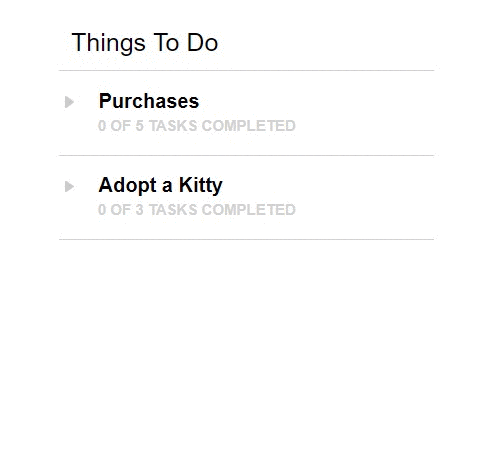

## React To-Do List

This is a simple, one page React to do list. This project is built using a simple static JSON file as a dataset to play around with making a to-do list that includes dependencies in React. Working on this project, I learned a lot about how to use react states and props as well as how to pass callback functions as props. 

### To-Do List In Action!

